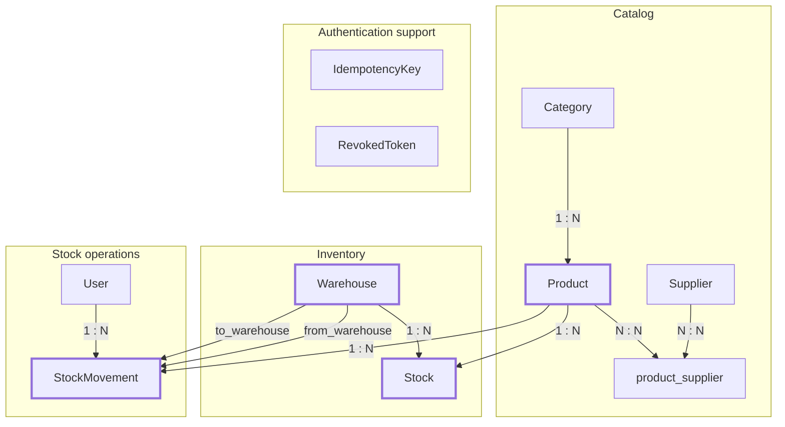

# LogiTrack - Inventory & Logistics ERP API


An async FastAPI backend for managing inventory across multiple warehouses. The core of it is a stock-movement service that processes incoming, outgoing, and inter-warehouse transfer operations against a schema with real constraints enforced at the database level, plus role-based access control, JWT authentication with token revocation, idempotent stock movements, and a consistent Router -> Service -> Repository split across every domain.

## Tech Stack

| Layer | Technology |
|---|---|
| Language / Runtime | Python 3.12 |
| API framework | FastAPI, Uvicorn |
| Database | PostgreSQL 16, SQLAlchemy 2.0 (async), Alembic |
| Auth | JWT (`PyJWT`), Argon2 password hashing (`pwdlib`) |
| Testing | pytest, pytest-asyncio, httpx (ASGI transport), in-memory SQLite |
| Infra | Docker, Docker Compose |
| Linting | Ruff |

## Architecture & Key Design Decisions

### Layering

Every domain - product, category, supplier, warehouse, stock, user - follows the same three layers. Router handles HTTP and validation, Service holds the business rules, Repository does the data access. No SQL shows up in a service, no business logic shows up in a router. That split isn't just for tidiness, it's why `test_stock_service.py` can test `StockService` against a mocked repository with no database involved at all.

### Data model

`Product` and `Supplier` connect through a `product_supplier` join table. `Stock` is limited to exactly one row per `(product_id, warehouse_id)` pair via a unique constraint, and quantity can never go negative, that's a `CHECK (quantity >= 0)` at the database level, not something left to application code to enforce. Every change to stock also writes an immutable `StockMovement` row, typed `IN`, `OUT`, or `TRANSFER`, with its own `CHECK (quantity > 0)`.




Stock movement requests also support an optional `Idempotency-Key`. The server stores a request fingerprint and the resulting response so that retries with the same key and payload return the original result instead of applying the movement twice. Reusing an idempotency key with a different request payload results in a `409 Conflict`.

### The core logic: processing a stock movement

`StockService.process_movement` does three things, in order:

1. Checks the movement type against which warehouse fields are populated: `IN` needs only `to_warehouse_id`, `OUT` needs only `from_warehouse_id`, `TRANSFER` needs both, and they have to be different warehouses.
2. For `OUT` and `TRANSFER`, checks there's enough stock before debiting anything, raising a domain-specific `InsufficientStockError` if there isn't.
3. Updates the relevant `Stock` row(s) and inserts the audit record - all inside a single `AsyncSession`.

Atomicity comes from the session-per-request pattern: `get_async_db` commits once at the end of the request and rolls back on any exception, so a `TRANSFER` that fails writing the destination side rolls back the source side with it - there's no state where only half a transfer went through.

The check-then-mutate sequence intentionally does not take a row lock (`SELECT ... FOR UPDATE`). Two concurrent requests hitting the same `(product_id, warehouse_id)` pair can both read the same quantity before either one commits. The database-level `CHECK (quantity >= 0)` prevents invalid negative stock from being committed, but full serialization would require row locking or optimistic concurrency control.

### Idempotency

`POST /stock/movements` accepts an optional `Idempotency-Key` header. Each key is stored together with a SHA-256 request fingerprint, the authenticated user ID, the response status, and the serialized response body.

A repeated request with the same key and payload returns the previously stored response. If the same key is reused with a different payload, the service raises `ResourceConflictError`, which is mapped to `409 Conflict`.

### Authentication & token revocation

Access tokens last 15 minutes and refresh tokens 7 days, with passwords hashed using Argon2. Both token types contain a unique `jti` identifier.

Logout revokes both the access and refresh token by storing their `jti` values in PostgreSQL. Every authenticated request checks whether its access token has been revoked, and refresh requests perform the same check for refresh tokens.

This makes logout effective server-side instead of relying only on client-side token removal.

### Turning exceptions into HTTP responses

A small exception hierarchy - `LogiTrackError`, `InsufficientStockError`, `InvalidMovementError`, `AlreadyExistsError`, and `ResourceConflictError` - gets raised entirely inside the service layer and mapped to 400/409/500 responses by centralized FastAPI exception handlers. Services never import anything HTTP-related, which is exactly what makes them testable without the web layer in the picture.

### Roles

Three roles - `admin`, `warehouse_manager`, `operator` - are enforced through a reusable `RoleChecker` dependency at the router level (`require_auth`, `require_manager`, `require_admin`). User management is admin-only; writing to catalog or warehouse data needs at least `warehouse_manager`.

## Project Structure

```text
LogiTrack/
├── alembic/                   # DB migrations
├── app/
│   ├── models/                # Product, Category, Supplier, Warehouse, Stock, StockMovement, User
│   ├── repositories/          # data access layer, one per aggregate
│   ├── services/              # business logic (stock transactions, RBAC, auth, idempotency)
│   ├── routers/               # REST endpoints, role-gated via RoleChecker
│   ├── schemas/               # Pydantic request/response models
│   ├── core/                  # db session, exceptions, security
│   ├── config.py
│   └── main.py
├── tests/{unit,integration}/
├── docker-compose.yaml        # postgres + api
└── Dockerfile
```

## Getting Started

### Docker (recommended)

```bash
git clone https://github.com/sa111nt/LogiTrack.git
cd LogiTrack
cp .env.example .env
# edit .env: set a real JWT_SECRET_KEY
docker compose up --build
```

The API is available at `http://localhost:8000`. Interactive docs at `http://localhost:8000/docs` (Swagger UI) or `http://localhost:8000/redoc`. Migrations run automatically on container start (`alembic upgrade head`).

### Local (without Docker)

Requires a running PostgreSQL instance reachable via `DATABASE_URL`.

```bash
pip install -r requirements.txt
cp .env.example .env   # edit DATABASE_URL to point at your local Postgres
alembic upgrade head
uvicorn app.main:app --reload
```

## Environment Variables

| Variable                      | Required | Default | Description                                         |
| ----------------------------- | -------- | ------- | --------------------------------------------------- |
| `DATABASE_URL`                | yes      | -       | Async PostgreSQL DSN (`postgresql+asyncpg://...`)   |
| `JWT_SECRET_KEY`              | yes      | -       | Sign this with a real secret, not the example value |
| `JWT_ALGORITHM`               | no       | `HS256` |                                                     |
| `ACCESS_TOKEN_EXPIRE_MINUTES` | no       | `15`    |                                                     |
| `REFRESH_TOKEN_EXPIRE_DAYS`   | no       | `7`     |                                                     |
| `DEBUG`                       | no       | `false` | Enables SQL echo and verbose logging                |

## API Overview

Full interactive documentation is generated automatically by FastAPI and served at `/docs` once the app is running - that's the source of truth for request/response schemas. Primary endpoints:

| Method | Path                                   | Min. role                   | Description                                                              |
| ------ | -------------------------------------- | --------------------------- | ------------------------------------------------------------------------ |
| `GET`  | `/health`                              | -                           | Liveness/version check                                                   |
| `POST` | `/api/v1/auth/register`                | -                           | Register a new user                                                      |
| `POST` | `/api/v1/auth/login`                   | -                           | OAuth2 password flow, returns access + refresh tokens                    |
| `POST` | `/api/v1/auth/refresh`                 | -                           | Exchange a refresh token for a new pair                                  |
| `POST` | `/api/v1/auth/logout`                  | any                         | Revoke the current access and refresh tokens                             |
| `GET`  | `/api/v1/auth/me`                      | any                         | Current authenticated profile                                            |
| `*`    | `/api/v1/users/*`                      | admin                       | User management (CRUD)                                                   |
| `*`    | `/api/v1/categories/*`, `/suppliers/*` | manager (write)             | Catalog reference data                                                   |
| `*`    | `/api/v1/products/*`                   | manager (write), any (read) | Product catalog                                                          |
| `*`    | `/api/v1/warehouses/*`                 | manager (write), any (read) | Warehouse registry                                                       |
| `POST` | `/api/v1/stock/movements`              | any                         | Process an IN / OUT / TRANSFER movement, with optional `Idempotency-Key` |
| `GET`  | `/api/v1/stock/movements`              | any                         | Movement history, filterable by type                                     |
| `GET`  | `/api/v1/stock/warehouse/{id}`         | any                         | Current inventory at a warehouse                                         |
| `GET`  | `/api/v1/stock/product/{id}`           | any                         | Stock levels for a product across all warehouses                         |

## Testing

```bash
pytest
```

Tests run against an in-memory SQLite database through `httpx`'s ASGI transport, so no Postgres instance is needed to run the suite. Unit tests hit the JWT/password module and `StockService`'s business rules directly - movement validation and insufficient-stock handling.

Integration tests cover user registration and login, authenticated profile access, logout and token revocation, product and category routes, stock movements, idempotency behavior, conflicting idempotency keys, and concurrent movement behavior.

## License

This project is licensed under the MIT License. See the [LICENSE](LICENSE) file for details.
